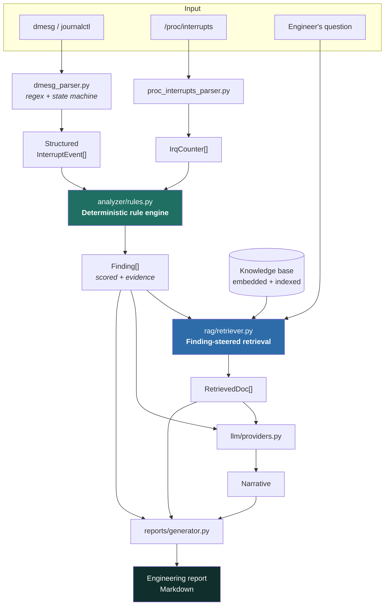

<div align="center">

# InterruptGPT

### RAG-Based Linux Kernel Interrupt Troubleshooter

*Turn hours of interrupt debugging into seconds — parse `dmesg` and `/proc/interrupts`,
get a scored root-cause analysis grounded in kernel documentation.*

[](https://github.com/<your-username>/interrupt-gpt/actions/workflows/ci.yml)
[](https://www.python.org/)
[](https://fastapi.tiangolo.com/)
[](https://www.docker.com/)
[](tests/)
[](LICENSE)

</div>

---

## 📋 Table of Contents

- [Overview](#-overview)
- [Problem Statement](#-problem-statement)
- [Industry Pain Points](#-industry-pain-points)
- [Solution Architecture](#-solution-architecture)
- [Features](#-features)
- [Quick Start](#-quick-start)
- [Example: Input to Output](#-example-input-to-output)
- [API Documentation](#-api-documentation)
- [How the Confidence Scoring Works](#-how-the-confidence-scoring-works)
- [Design Decisions](#-design-decisions)
- [Project Structure](#-project-structure)
- [Testing](#-testing)
- [Deployment](#-deployment)
- [Performance Characteristics](#-performance-characteristics)
- [Limitations](#-limitations)
- [Future Scope](#-future-scope)
- [License](#-license)

---

## 🎯 Overview

**InterruptGPT** is a troubleshooting assistant for Linux interrupt problems. Feed it a
`dmesg` capture and a `/proc/interrupts` snapshot, and it will:

1. **Parse** unstructured kernel logs into structured interrupt events
2. **Analyse** them with a deterministic rule engine that scores root causes by confidence
3. **Retrieve** relevant kernel documentation via semantic search (RAG)
4. **Generate** a narrative root-cause analysis and a full engineering report

The system is designed so that **the diagnosis never depends on a language model**. Findings,
confidence scores and evidence come from an auditable rule engine; the LLM only writes the
narrative. If no model is reachable, a grounded fallback narrative is composed from the same
structured evidence — so the tool degrades in quality, never in correctness.

---

## 🔍 Problem Statement

Interrupt failures are among the hardest issues to debug in production Linux systems. A single
`irq 16: nobody cared` message can mean a driver bug, a firmware routing error, a hardware
fault, or an MSI allocation failure — and telling them apart requires reading logs, counters,
driver source, and kernel documentation side by side.

Typical investigation path:

```
Issue occurs → collect logs → read kernel docs → search forums
   → read driver source → compare past incidents → identify cause → fix
```

This routinely takes **2–8 hours** and depends on engineers who already understand IRQ routing,
interrupt controllers, MSI/MSI-X, and CPU affinity — creating a knowledge bottleneck on a small
number of senior people.

---

## ⚠️ Industry Pain Points

| Pain point | Impact |
|---|---|
| **Time consumption** | 2–8 hours of senior engineering time per incident |
| **Expert dependency** | Junior engineers can't independently interpret IRQ routing, MSI/MSI-X, or affinity |
| **Fragmented knowledge** | Answers scattered across kernel docs, source, forums, and internal runbooks |
| **No guided reasoning** | Existing tools *display* counters; they don't explain **why** or **what to do** |

---

## 🏗️ Solution Architecture



### Why retrieval is steered by findings, not raw logs

Embedding a raw kernel log and searching with it retrieves poorly — logs are full of hex
addresses, timestamps and device paths that dominate the embedding but carry no semantic signal.
Instead, the rule engine runs **first**, and each finding contributes a targeted query built from
its title plus curated tag hints (see `RULE_TAG_HINTS`). Retrieval is therefore driven by *what
was actually diagnosed*, which produces far more relevant references.

---

## ✨ Features

### 1. Interrupt log parser
Handles both boot-time (`[ 312.774519]`) and syslog (`Mar 14 09:12:01 host kernel:`) prefixes.
Handler continuation lines are attached to the event they belong to — the kernel emits
`handlers:` followed by a block of symbol lines, which naive line-by-line parsers lose.

### 2. IRQ analyzer
Six rules covering unhandled interrupts, shared-line conflicts, storms, affinity imbalance,
MSI allocation failure, and APIC error counters.

### 3. Semantic documentation search
Vector search over an indexed kernel knowledge base, with graceful backend degradation.

### 4. RAG engine
Retrieved context is injected into the LLM prompt with an explicit instruction not to
speculate beyond the supplied evidence.

### 5. Root cause analysis with confidence
Evidence-driven scoring — see [below](#-how-the-confidence-scoring-works).

### 6. Engineering report generator
Seven-section Markdown report: summary, symptoms, root cause, evidence, recommended actions,
preventive measures, references.

### 7. Chat interface
Free-form questions (`"Why was IRQ 16 disabled?"`), optionally grounded in uploaded logs.

---

## 🚀 Quick Start

### Docker (recommended)

```bash
git clone https://github.com/<your-username>/interrupt-gpt.git
cd interrupt-gpt
docker compose up --build
```

API at `http://localhost:8000`, interactive docs at `http://localhost:8000/docs`.

> The compose file also starts Ollama. Pull a model once it's up:
> `docker compose exec ollama ollama pull llama3`

### Local development

```bash
python -m venv .venv && source .venv/bin/activate
pip install -r requirements-dev.txt

# Run the API
PYTHONPATH=backend uvicorn app.main:app --reload --port 8000

# Or analyse a file directly, no server needed
python scripts/analyze_cli.py \
  --dmesg datasets/sample_logs/dmesg_shared_irq.log \
  --interrupts datasets/sample_logs/interrupts_shared.txt
```

### Frontend

Open `frontend/index.html` in a browser (it targets `http://localhost:8000`), or serve it:

```bash
python -m http.server 5173 --directory frontend
```

### Configuration

| Variable | Default | Purpose |
|---|---|---|
| `OLLAMA_HOST` | `http://localhost:11434` | Ollama endpoint |
| `OLLAMA_MODEL` | `llama3` | Model name |
| `INTERRUPTGPT_DISABLE_LLM` | unset | `1` forces the deterministic backend |
| `INTERRUPTGPT_SEMANTIC_EMBEDDINGS` | `1` | `0` forces TF-IDF instead of sentence-transformers |

---

## 📥 Example: Input to Output

**Input** — `dmesg`:

```text
[    1.204698] ahci 0000:00:1f.2: irq 16 for MSI/MSI-X failed, falling back to INTx
[  312.774519] irq 16: nobody cared (try booting with the "irqpoll" option)
[  312.774523] handlers:
[  312.774529] [<ffffffff810f0f70>] ahci_interrupt
[  312.774534] [<ffffffff81102ab0>] usb_hcd_irq
[  312.774540] Disabling IRQ #16
```

**Input** — `/proc/interrupts`:

```text
           CPU0       CPU1       CPU2       CPU3
 16:     418922        112         98        104   IO-APIC   16-fasteoi   ahci, uhci_hcd:usb1, eth0
ERR:       1847
```

**Output** — actual CLI output from these files:

```text
[ 95%] CRITICAL Unhandled interrupt on IRQ 16 (kernel gave up on the line)
        - [  312.774519] irq 16: nobody cared (try booting with the "irqpoll" option)
        - [  312.774540] Disabling IRQ #16
        - Kernel subsequently disabled the IRQ line.
        - Registered handler(s): ahci_interrupt, usb_hcd_irq.
        - /proc/interrupts shows IRQ 16 shared by: ahci, uhci_hcd:usb1, eth0.

[ 87%] WARNING  Shared interrupt conflict on IRQ 16
[ 80%] WARNING  IRQ 16 traffic concentrated on CPU0
[ 70%] WARNING  Non-zero APIC ERR counter (1,847)
[ 63%] WARNING  MSI/MSI-X setup failed; device likely fell back to legacy INTx
[ 55%] WARNING  Possible high interrupt rate on IRQ 16 (unconfirmed)
```

Note the narrative these findings assemble into: MSI allocation failed → the device fell back to
shared legacy INTx → the shared line went unclaimed → the kernel disabled it → storage timed out.
Each step is independently evidenced.

---

## 📡 API Documentation

Interactive OpenAPI docs are served at `/docs`.

| Method | Endpoint | Description |
|---|---|---|
| `GET` | `/health` | Liveness probe + resolved backends |
| `POST` | `/api/analyze` | Analyse pasted log text |
| `POST` | `/api/analyze/upload` | Analyse uploaded files (multipart) |
| `POST` | `/api/chat` | Free-form Q&A, optionally log-grounded |
| `GET` | `/api/search?q=&k=` | Semantic search over the knowledge base |

<details>
<summary><b>Example request/response</b></summary>

```bash
curl -X POST http://localhost:8000/api/analyze \
  -H 'Content-Type: application/json' \
  -d '{
        "dmesg": "[ 312.7 ] irq 16: nobody cared\n[ 312.8 ] Disabling IRQ #16",
        "proc_interrupts": " 16:  418922  112  IO-APIC  16-fasteoi  ahci, eth0"
      }'
```

```jsonc
{
  "findings": [
    {
      "rule_id": "IRQ_NOBODY_CARED",
      "title": "Unhandled interrupt on IRQ 16 (kernel gave up on the line)",
      "severity": "critical",
      "confidence": 0.95,
      "irq": 16,
      "drivers": ["ahci"],
      "evidence": ["...", "..."],
      "recommendations": ["..."]
    }
  ],
  "references": [{ "doc_id": "kb-nobody-cared", "title": "...", "score": 0.91 }],
  "narrative": "The most likely root cause is ...",
  "report_markdown": "# Interrupt Incident Report ...",
  "llm_backend": "template | retrieval: tfidf + numpy"
}
```
</details>

---

## 🎚️ How the Confidence Scoring Works

Confidence is **evidence-driven, not model-generated**. Each rule starts at a base score and
gains a bounded increment per corroborating signal:

```
IRQ_NOBODY_CARED
  base                                    0.62
  + kernel also disabled the line        +0.18
  + handler symbols identified           +0.08
  + /proc/interrupts confirms sharing    +0.12
  ────────────────────────────────────────────
  = 0.95 (capped)
```

Two deliberate properties:

- **Reproducible.** The same input always produces the same score. No sampling, no drift.
- **Never certain.** Scores are capped at **95%**. The tool works from partial evidence — one log
  capture, cumulative counters, no hardware access — so claiming 100% would be dishonest. This is
  enforced by a test (`test_never_claims_absolute_certainty`).

---

## 🧠 Design Decisions

<details>
<summary><b>Why a rule engine instead of asking the LLM to diagnose?</b></summary>

Kernel debugging demands auditability. An engineer acting on a diagnosis needs to see *which log
line* justified it. A rule engine gives deterministic, inspectable findings with explicit evidence
chains; the LLM's role is limited to writing readable prose over those findings. This also means
the system produces correct results with no model available at all.
</details>

<details>
<summary><b>Why does storm detection refuse to be confident?</b></summary>

`/proc/interrupts` counters are **cumulative since boot**. A line showing 419,236 interrupts might
be a storm — or an ordinary device on a machine with 200 days of uptime. A single sample cannot
distinguish them.

An earlier version of the rule flagged this as a CRITICAL storm at 70% confidence. That was a
false positive on the sample data. The rule now only reports **CRITICAL** when the kernel itself
logged a storm; counter dominance alone yields `IRQ_STORM_CANDIDATE` at lower confidence, with the
limitation stated in the evidence and the fix (sample twice, compare the delta) as the top
recommendation. Locked in by `test_storm_confirmed_only_by_explicit_log_message`.
</details>

<details>
<summary><b>Why two embedding backends and two vector indexes?</b></summary>

`sentence-transformers` + FAISS is the production path, but it pulls ~500 MB of model weights.
That's hostile to CI, to a quick `docker run`, and to anyone evaluating the project. So both
layers degrade: TF-IDF+SVD substitutes for the embedder, and an exact numpy inner-product index
substitutes for FAISS. At knowledge-base scale the numpy index is *exact* — it loses only speed,
which is irrelevant below ~10k documents. Selection is automatic (`build_embedder`, `build_index`).
</details>

<details>
<summary><b>Why is the affinity rule careful about calling imbalance a bug?</b></summary>

Pinning a NIC queue to a core on the same NUMA node is a deliberate, common latency optimisation.
The rule therefore requires both a high busiest/quietest ratio *and* a meaningful absolute volume
before reporting, and its recommendations lead with "inspect the mask" rather than assuming a fault.
</details>

---

## 📂 Project Structure

```text
interrupt-gpt/
├── backend/app/
│   ├── main.py                       # FastAPI app + routes
│   ├── core/
│   │   ├── models.py                 # Pydantic domain model
│   │   └── pipeline.py               # parse → analyze → retrieve → generate
│   ├── parsers/
│   │   ├── dmesg_parser.py
│   │   └── proc_interrupts_parser.py
│   ├── analyzer/rules.py             # deterministic rule engine
│   ├── rag/
│   │   ├── embeddings.py             # sentence-transformers | TF-IDF
│   │   ├── vector_store.py           # FAISS | numpy
│   │   └── retriever.py              # knowledge base + finding-steered search
│   ├── llm/providers.py              # Ollama | deterministic template
│   └── reports/generator.py          # markdown report
├── datasets/
│   ├── kernel_docs/knowledge_base.json
│   └── sample_logs/                  # reproducible fixtures
├── frontend/index.html               # zero-build UI
├── scripts/analyze_cli.py            # offline CLI
├── tests/test_interruptgpt.py        # 49 tests
├── .github/workflows/ci.yml
├── Dockerfile · docker-compose.yml
└── requirements*.txt
```

---

## 🧪 Testing

```bash
INTERRUPTGPT_DISABLE_LLM=1 INTERRUPTGPT_SEMANTIC_EMBEDDINGS=0 pytest -q
# 49 passed
```

Coverage spans parsers (prefix formats, handler attachment, malformed input), the rule engine
(each rule, plus negative cases so healthy systems stay quiet), retrieval (relevance,
deduplication), the pipeline, and every API endpoint including error paths.

The environment variables keep runs hermetic — no model downloads, no network, deterministic
assertions. CI sets them globally.

---

## 🚢 Deployment

```bash
docker compose up -d --build          # API + Ollama
curl http://localhost:8000/health
```

The image runs as a non-root user (uid 10001) and declares a `HEALTHCHECK`. CI builds the image
and smoke-tests `/health` inside a running container before considering a build green.

---

## 📊 Performance Characteristics

Measured on the bundled sample data (4-core container, TF-IDF + numpy backends):

| Stage | Time |
|---|---|
| Parse `dmesg` + `/proc/interrupts` | < 5 ms |
| Rule engine (6 rules) | < 2 ms |
| Retrieval (10 docs indexed) | < 10 ms |
| Full request, no LLM | **≈ 25 ms** |
| Index build (startup, once) | ≈ 300 ms |

With Ollama attached, wall time is dominated by model generation (typically 2–15 s depending on
model and hardware). The diagnosis itself is always available in milliseconds — the narrative is
the only part that waits.

---

## ⚠️ Limitations

Stated plainly, because a diagnostic tool that oversells itself is worse than none:

- **Single-sample counters.** Rate-based problems can't be confirmed from one `/proc/interrupts`
  snapshot. The tool says so rather than guessing.
- **Knowledge base is curated, not exhaustive.** It ships with 10 authored documents covering the
  common interrupt failure modes. It is not a mirror of the full kernel documentation tree;
  point `datasets/kernel_docs/` at a larger corpus to extend it.
- **No source-code analysis.** The tool reasons about logs and counters, not driver source.
- **Rules cover common failure modes**, not exotic ones (IOMMU interrupt remapping faults,
  virtualised interrupt delivery, and platform-specific errata are out of scope today).
- **LLM narratives should be read as summaries**, not authority. The findings table is the
  authoritative output.

---

## 🔭 Future Scope

- Two-sample counter diffing for true interrupt-rate measurement
- Driver source-code retrieval and correlation
- Kernel crash-dump (`vmcore`) ingestion
- GraphRAG / Neo4j knowledge graph over IRQ → driver → device relationships
- Historical incident store for "we've seen this before" matching
- Prometheus exporter + Grafana dashboard for continuous monitoring
- Kubernetes manifests and Helm chart

---

## 📄 License

MIT — see [LICENSE](LICENSE).

<div align="center">

Built for engineers who've spent an afternoon staring at `nobody cared`.

</div>
